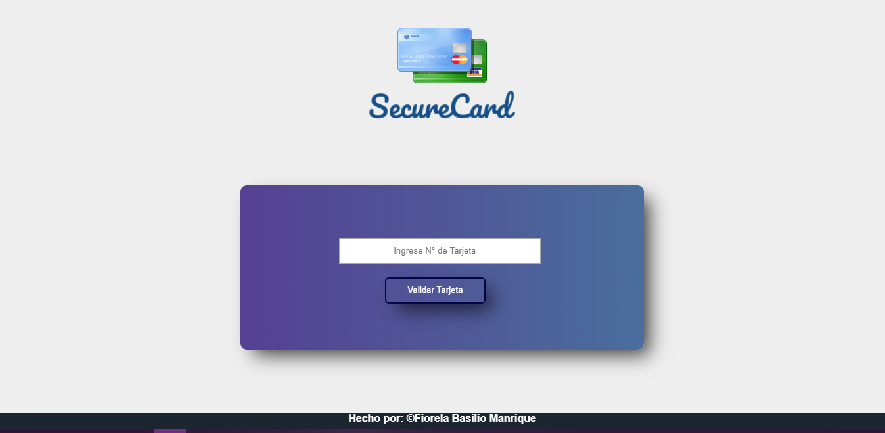
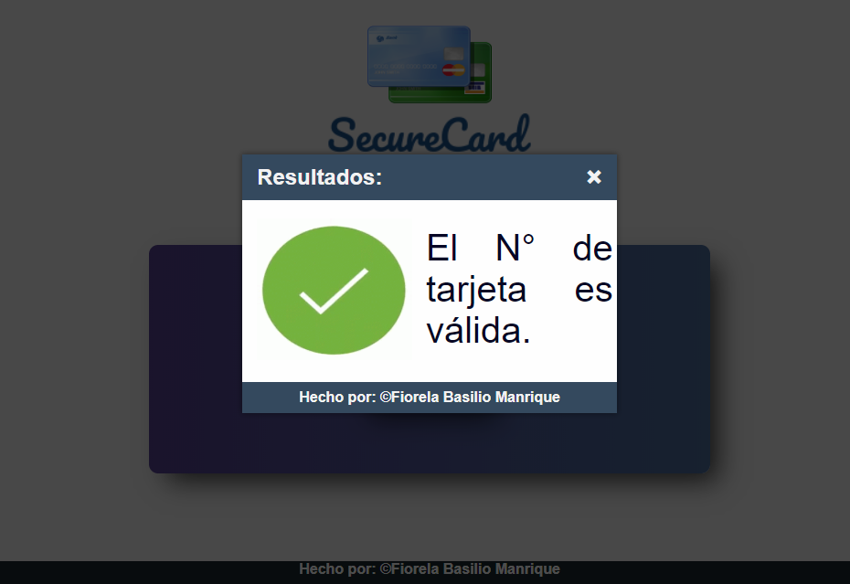
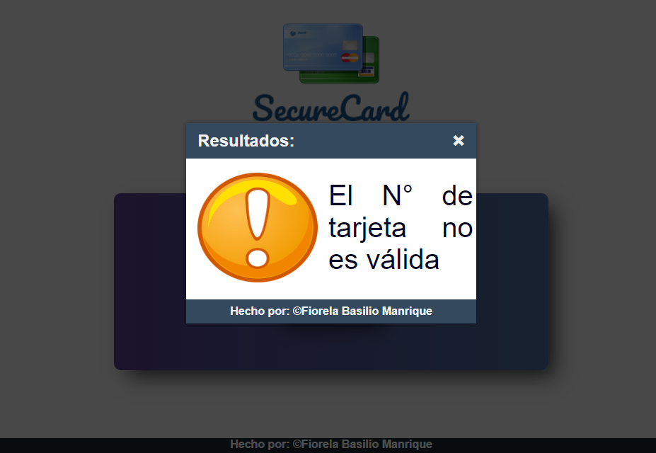
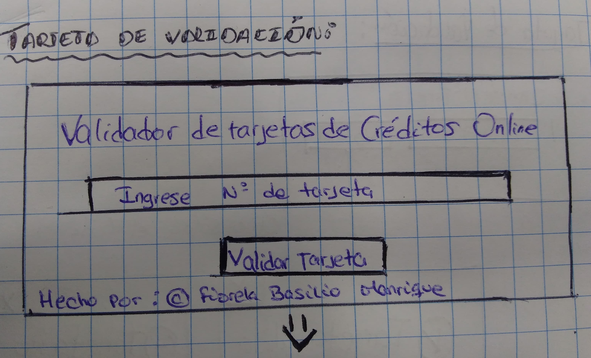
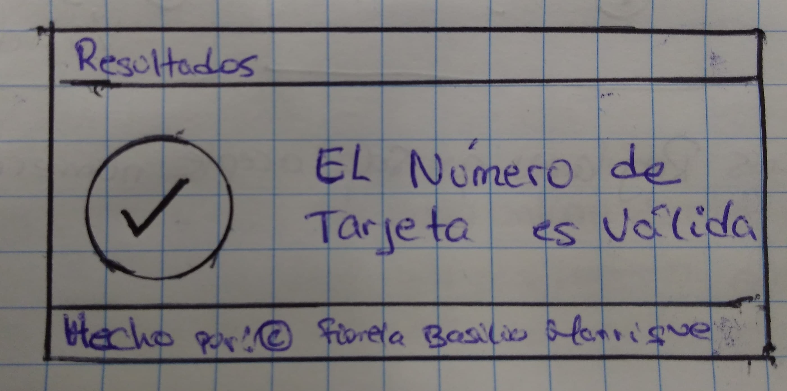
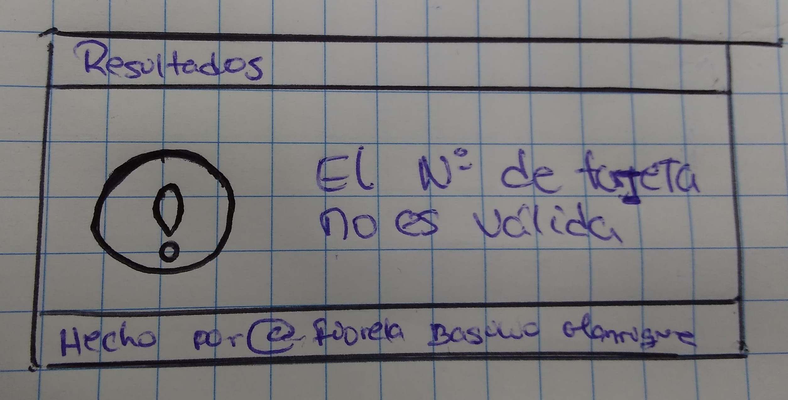
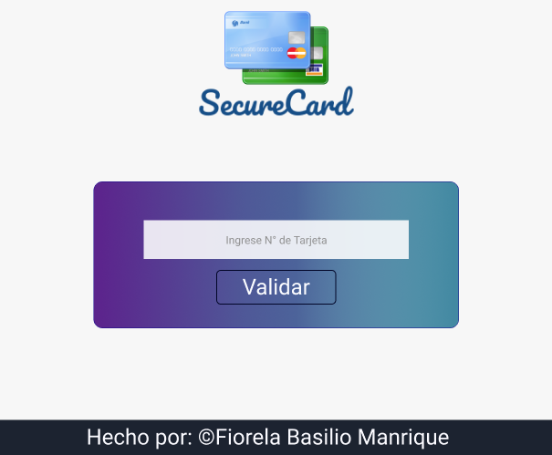
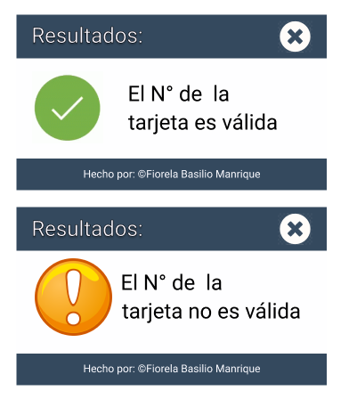

# SecureCard

## Índice

* [1. Resumen del proyecto](#2-resumen-del-proyecto)
* [2. Imagen Final del Proyecto](#3-objetivos-de-aprendizaje)
* [3. Investigación UX](#4-consideraciones-generales)
* [4. Prototipo en Papel](#5-criterios-de-aceptación-mínimos-del-proyecto)
* [5. Feeback Recibido](#7-pistas-tips-y-lecturas-complementarias)
* [6. Prototipo Final](#7-pistas-tips-y-lecturas-complementarias)
* [7. Objetivos de aprendizaje](#3-objetivos-de-aprendizaje)
* [8. Prototipo en Figma](#3-objetivos-de-aprendizaje)

***

## Resumen del proyecto

Para nuestros clientes los más importante es la seguridad al momento de ingresar un número de tarjeta, para realizar dicho proceso.
**SecureCard** busca proteger y comprobar si un número ingresado es válido o no es válido.

## Imagen Final del Proyecto

- Ingresemos un N° de Tarjeta para comprobar.

- Si la tarjeta es válida se va mostrar el siguiente modal.

- Caso contrario le mostrará lo siguiente.

## Investigación UX

Los Usuarios que van a acceder a  **SecureCard** son personas que quieren saber si el número de tarjeta es válida o no. Al no contar con un validador no puede tener el conocimiento cuando un numero de tarjeta ingresado es correcto o incorrecto es por ello que no hay seguridad correspondiente y los clientes al registrarse aun sitio web no quieran proporcionar su información real por falta de desconfianza,etc.

Por está razón el **SecureCard** es el mejor aliado para **resguardar la seguridad de nuestros clientes**, ya no sentiran la desconfianza al momento de ingresar la informacion de su tarjeta.
<!-- sólo pueden ser usadas con fines de pruebas, registros en sitios web donde no queremos proporcioanar nuestra información real por falta de confianza, etc. -->

## Prototipado en Papel

## Feedback Recibido

- Cambiar los colores de mi página ya que no combinaban.

## Prototipado en Figma

## Objetivos de aprendizaje Tarjeta de crédito válida

A continuación te presentamos los objetivos de aprendizaje de este proyecto. Reflexiona y luego marca los objetivos que has llegado a **entender** y **aplicar** en tu proyecto.

### UX

- [x] Diseñar la aplicación pensando y entendiendo al usuario. 
- [x] Crear prototipos para obtener feedback e iterar. 
- [ ] Aplicar los principios de diseño visual (contraste, alineación, jerarquía). 

### HTML y CSS

- [x] Uso correcto de HTML semántico. 
- [x] Uso de selectores de CSS. 
- [x] Construir tu aplicación respetando el diseño realizado (maquetación). 

### DOM

- [x] Uso de selectores del DOM. 
- [x] Manejo de eventos del DOM. 
- [ ] Manipulación dinámica del DOM. 

### Javascript

- [x] Manipulación de strings. 
- [x] Uso de condicionales (if-else | switch). 
- [x] Uso de bucles (for | do-while). 
- [x] Uso de funciones (parámetros | argumentos | valor de retorno). 
- [x] Declaración correcta de variables (const & let). 
- [ ] Uso de ES Modules (import | export). 

### Testing
- [ ] Testeo de tus funciones. 

### Git y GitHub
- [x] Comandos de git (add | commit | pull | status | push). 
- [x] Manejo de repositorios de GitHub (clone | fork | gh-pages). 

### Buenas prácticas de desarrollo
- [ ] Organizar y dividir el código en módulos (Modularización). 
- [ ] Uso de identificadores descriptivos (Nomenclatura | Semántica). 